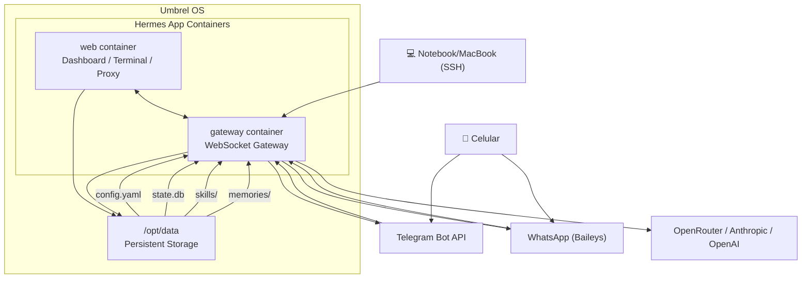

# 📊 Diagrama de Arquitetura

> Diagrama completo da arquitetura Hermes Agent no Umbrel OS.
> Veja [`../docs/arquitetura.md`](../docs/arquitetura.md) para a explicação detalhada.



## Fluxo de uma mensagem

```
1. Usuário envia mensagem no Telegram/WhatsApp
2. Plataforma entrega ao gateway (polling no Telegram)
3. Gateway carrega contexto da sessão (state.db)
4. Gateway envia prompt ao modelo de IA (OpenRouter)
5. Modelo responde com texto ou tool calls
6. Gateway executa ferramentas e devolve ao modelo
7. Resposta final é entregue ao usuário
8. Conversa é persistida em state.db
```

## Persistência

```
/opt/data/
├── config.yaml          ← Config principal
├── .env                 ← API keys (⚠️ nunca commitado)
├── SOUL.md              ← Personalidade
├── state.db             ← SQLite (sessões, mensagens)
├── skills/              ← Skills instaladas
├── memories/            ← Memórias de longo prazo
├── sessions/            ← Histórico (.jsonl)
└── logs/                ← Logs do sistema
```
