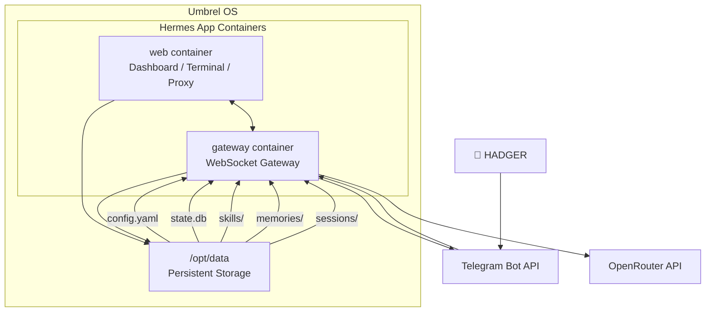

## Legenda

| Componente | Tecnologia | Função |
|---|---|---|
| `web` | Docker container | Dashboard, terminal web, proxy |
| `gateway` | Docker container | Gateway de mensagens WebSocket |
| `/opt/data` | Docker volume (persistente) | Armazenamento durável |
| Telegram Bot API | HTTPS | Comunicação com o usuário |
| OpenRouter API | HTTPS | Acesso a modelos de IA |

## Fluxo de uma mensagem

```
1. Usuário envia mensagem no Telegram
2. Telegram Bot API entrega ao gateway (webhook polling)
3. Gateway processa e envia à API de IA (OpenRouter)
4. API de IA retorna a resposta
5. Gateway envia resposta de volta ao Telegram
6. Usuário recebe a resposta
```

## Persistência

Tudo que sobrevive a reinícios e updates do app fica em `/opt/data`:

```
/opt/data/
├── config.yaml          ← Configuração principal
├── .env                 ← API keys
├── state.db             ← Banco SQLite do gateway
├── SOUL.md              ← Personalidade do agente
├── skills/              ← Skills instaladas
├── sessions/            ← Histórico de conversas
├── memories/            ← Memórias de longo prazo
│   ├── MEMORY.md
│   └── USER.md
└── logs/                ← Logs do sistema
```
