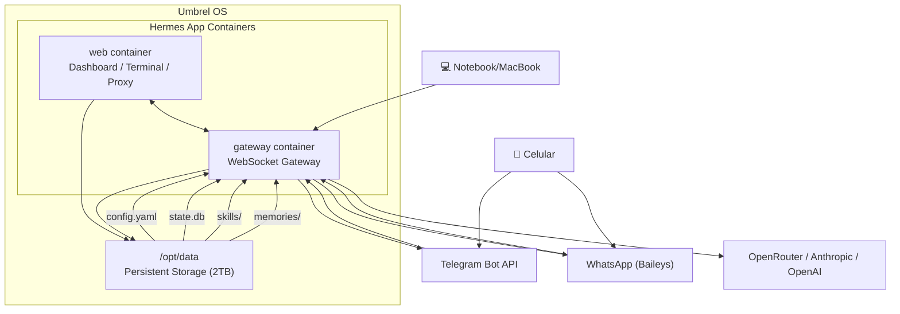

# 🏗 Arquitetura

> Como o Hermes Agent funciona dentro do Umbrel OS.

---

## Diagrama de componentes



---

## Containers

O app Hermes Agent no Umbrel consiste em dois containers Docker:

| Container | Imagem | Função |
|---|---|---|
| `web` | `hermes-agent-web` | Dashboard web (acessível via proxy Umbrel), terminal embutido, proxy reverso interno |
| `gateway` | `hermes-agent-gateway` | Gateway de mensagens: gerencia conexões com Telegram, WhatsApp, Discord e outros; mantém o loop principal do agente |

Ambos compartilham `/opt/data` via volume Docker — é assim que configurações, skills e memórias persistem entre reinícios e updates.

---

## Fluxo de uma mensagem

```
1. Usuário envia mensagem no Telegram/WhatsApp/Discord
2. Plataforma entrega ao gateway (polling no Telegram, WebSocket nos outros)
3. Gateway identifica a sessão (state.db) e carrega o contexto
4. Contexto é enviado ao modelo de IA via API (OpenRouter, Anthropic, etc.)
5. Modelo retorna texto ou tool calls
6. Se tool call: gateway executa e envia resultado de volta ao modelo
7. Resposta final é entregue ao usuário na plataforma de origem
8. Conversa é salva em state.db (sessions)
```

---

## Persistência

**Tudo** que sobrevive a reinícios e updates do app fica em `/opt/data`:

```
/opt/data/
├── config.yaml              ← Config principal (modelos, plataformas)
├── .env                     ← Segredos (API keys, tokens)
├── SOUL.md                  ← Personalidade do agente
├── state.db                 ← SQLite: sessões, mensagens, routing
├── skills/                  ← Skills instaladas (Markdown + scripts)
├── memories/                ← Memórias cross-session (MEMORY.md, USER.md)
├── sessions/                ← Transcripts (.jsonl)
├── logs/                    ← Logs de execução
├── profiles/                ← Perfis de usuário (se múltiplos)
├── .cache/                  ← Cache (uv, npm, pip) — descartável
├── image_cache/             ← Imagens recebidas via chat
└── audio_cache/             ← Áudios recebidos via chat
```

> ⚠️ Arquivos fora de `/opt/data` são **descartados** a cada update do app no Umbrel.

---

## Comunicação entre containers

```
                 ┌──────────────┐
    Dashboard ◄──│              │
    do Umbrel    │  web (proxy) │
                 │  :18789      │
                 └──────┬───────┘
                        │ HTTP (localhost)
                 ┌──────▼───────┐
    Telegram  ◄──│              │──► OpenRouter API
    WhatsApp  ◄──│   gateway    │──► Anthropic API
    Discord   ◄──│   :18789     │──► OpenAI API
                 └──────────────┘
```

- **web → gateway:** HTTP em `localhost:18789` (rede Docker interna)
- **gateway → externo:** HTTPS para APIs de IA e plataformas de mensageria
- **Nada é exposto publicamente** sem configuração explícita do proxy Umbrel

---

## Modelo de aprovações

O Hermes tem um sistema de segurança que pede confirmação antes de comandos perigosos:

| Modo | Comportamento |
|---|---|
| `manual` | Pergunta ao usuário antes de cada comando de risco (padrão) |
| `smart` | Auto-aprova comandos de baixo risco, pergunta nos de alto |
| `off` | Sem confirmação (⚠️ apenas dev/homologação) |

A decisão de risco é feita pelo **Tirith** — scanner de segurança integrado que analisa cada comando antes da execução.

---

## Próximo passo

- [`dispositivos.md`](dispositivos.md) — Conectar celular, notebook e outros
- [`configuracao.md`](configuracao.md) — Personalizar comportamento
